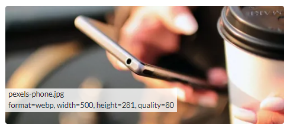

# PictureRenderer.Optimizely
[PictureRenderer](https://github.com/ErikHen/PictureRenderer) for Optimizely CMS (former Episerver).<br>
Makes it super simple to render html picture element for your Optimizely CMS MVC/Razor pages. 
CMS editors don't have to care about image sizes or formats. 
The most optimal image will always be used depending on the capabilities, screen size, and pixel density of the device that is used when visiting your web site.
<br>
The result is optimized (width, format, quality), lazy loaded, and responsive images.

If you are unfamiliar with the details of the Picture element i recommend reading
 [this](https://webdesign.tutsplus.com/tutorials/quick-tip-how-to-use-html5-picture-for-responsive-images--cms-21015) and/or [this](https://www.smashingmagazine.com/2014/05/responsive-images-done-right-guide-picture-srcset/).

PictureRenderer.Optimizely builds upon [Baaijte.OptimizelyImageSharp.Web](https://github.com/vnbaaij/Baaijte.Optimizely.ImageSharp.Web)
 and [ImageSharp](https://github.com/SixLabors/ImageSharp), so please show appreciation by starring these libraries.

## How to install
* Add [Baaijte.OptimizelyImageSharp.Web](https://nuget.optimizely.com/package/?id=Baaijte.Optimizely.ImageSharp.Web) to your solution. Add the needed [configuration](https://github.com/vnbaaij/Baaijte.Optimizely.ImageSharp.Web#setup-and-configuration).
* Add [PictureRenderer.Optimizely](https://nuget.optimizely.com/package/?id=PictureRenderer.Optimizely) to your solution.

## How to use

#### 1. Define picture profiles
Create Picture profiles for the different types of images that you have on your web site. A Picture profile describes how an image should be scaled in various cases. <br>
You could for example create Picture profiles for: "Top hero image", "Teaser image", "Image gallery thumbnail".
````C#
using PictureRenderer.Optimizely;

namespace MyNamespace
{
    public static class PictureProfiles
    {
        // Sample image
        // Up to 640 pixels viewport width, the picture width will be 100% of the viewport.
        // Up to 1200 pixels viewport width, the picture width will be 320 pixels.
        // On larger viewport width, the picture width will be 750 pixels.
        // Note that picture width is not the same as image width (but it can be, on screens with a "device pixel ratio" of 1).
        public static readonly PictureProfile SampleImage = new()
        {
            SrcSetWidths = new[] { 320, 640, 750, 1500 },
            Sizes = new[] { "(max-width: 640px) 100vw", "(max-width: 1200px) 320px", "750px" },
            AspectRatio = 1.777 // 16:9 = 16/9 = 1.777
        };

        // Top hero
        // Picture width is always 100% of the viewport width.
        public static readonly PictureProfile TopHero = new()
        {
            SrcSetWidths = new[] { 1024, 1366, 1536, 1920 },
            Sizes = new[] { "100vw" },
            AspectRatio = 2
        };

        // Thumbnail
        // Thumbnail is always 150px wide. But the browser may still select the 300px image for a high resolution screen (e.g. mobile or tablet screens).
        public static readonly PictureProfile Thumbnail = new()
        {
            SrcSetWidths = new[] { 150, 300 },
            Sizes = new[] { "150px" },
            AspectRatio = 1  //square image (equal height and width).
        };

        // Multi-image
        // Show different images depending on media conditions (e.g. different image for mobile sized screen).
        public static readonly PictureProfile MultiImageSample = new()
        {
            // First image will be resized to 600px width, and will be shown when viewport width is greater than 600px.
            // Second image will be resized to 300px width, and will be shown when viewport width is less than 600px.
            // Note: if second image isn't available, the first image will be used instead.
            MultiImageMediaConditions = new[] { new MediaCondition("(min-width: 600px)", 600), new MediaCondition("(max-width: 600px)", 300) },
            AspectRatio = 1.777
        };
    }
}
````
* **SrcSetWidths (for single image)** – The different image widths you want the browser to select from. These values are used when rendering the srcset attribute.
* **Sizes (for single image)** – Define the size (width) the image should be according to a set of “[media conditions](https://developer.mozilla.org/en-US/docs/Learn/HTML/Multimedia_and_embedding/Responsive_images)” (similar to css media queries). Values are used when rendering the sizes attribute.
* **MultiImageMediaConditions (for multi image)** - Define image widths for different media conditions. 
* **AspectRatio (optional)** – The wanted aspect ratio of the image (width/height). Ex: An image with aspect ratio 16:9 = 16/9 = 1.777.
* **Quality (optional)** - Image quality. Lower value = less file size. Not valid for all image formats. Default value: 80.
* **CreateWebpForFormat (optional)** - The image formats that should be offered as webp versions. Jpg format is added by default.
* **FallbackWidth (optional)** – This image width will be used in browsers that don’t support the picture element. Will use the largest image if not set.
* **ImgWidthHeight (optional)** - If true, width and height attributes will be rendered on the img element.
* **ShowInfo (optional)** - If true, an overlay will show info about the currently selected image.

See also the [sample site](https://github.com/ErikHen/PictureRenderer.Samples/tree/main/OptimizelyCMS)


#### 2. Render picture element with the Picture Html helper 

```@Html.Picture(Model.CurrentPage.TestImage1, PictureProfiles.SampleImage)```
#### Parameters
* **imageReference/imageReferences** - ContentReference to your image, or array for multi image.
* **profile** - The Picture profile that specifies image widths, etc..
* **altText (optional)** - Img element `alt` attribute (will overrride alt text set on image).
* **lazyLoading (optional)** - Type of lazy loading. Currently only [browser native lazy loading](https://developer.mozilla.org/en-US/docs/Web/Performance/Lazy_loading#images_and_iframes), or none (defaults to browser native).
* **cssClass (optional)** - Css class for img element. 
<br>

The result (for single image) would be something like this
```xhtml
<picture>
<source srcset="
 /contentassets/c9c99316ae264c6b9a092b4f56024539/myimage.jpg?width=320&height=180&quality=80 320w,
 /contentassets/c9c99316ae264c6b9a092b4f56024539/myimage.jpg?width=640&height=360&quality=80 640w,
 /contentassets/c9c99316ae264c6b9a092b4f56024539/myimage.jpg?width=750&height=422&quality=80 750w,
 /contentassets/c9c99316ae264c6b9a092b4f56024539/myimage.jpg?width=1500&height=844&quality=80 1500w"
 sizes="(max-width: 640px) 100vw, (max-width: 1200px) 320px, 750px" />

</picture>
```
<br>

### Check that everyhting works as expected
If you set ```ShowInfo = true``` in the picture profile, an overlay with information about the currently selected image will be rendered.<br>
You can see that different images are selected for different devices and screen sizes. Note that the Chrome (Chromium based) browser will not select a smaller image if a larger one is already downloaded. It may be easier to see the actual behaviour when using e.g. Firefox.
<br>
<br>
This setting should of course never be used in your live/production environment, it's only meant for testing. 


## Webp format
The rendered picture element will also contain [webp](https://developers.google.com/speed/webp/) versions of the image. By default this will be rendered for jpg images. <br>
If you also want png images to be converted to WebP you can define that in your Picture profile. Just add ```CreateWebpForFormat```, which is an array of the formats that will be converted.
```c#
CreateWebpForFormat = new []{ PictureRenderer.ImageFormat.Jpeg, PictureRenderer.ImageFormat.Png }
```


## Alt text
You can add a string field on your Image content model, and name it "AltText". The value of this field will be used when rendering the alt text in the picture element.
```c#
namespace MySite.Models.Media
{
    [ContentType(GUID = "0A89E464-56D4-449F-AEA8-2BF774AB8730")]
    [MediaDescriptor(ExtensionString = "jpg,jpeg,jpe,ico,gif,bmp,png")]
    public class ImageFile : ImageData 
    {
        [Display(Name = "Alt text", Order = 10)]
        public virtual string AltText { get; set; }
    }
}
```
## Focal point
Add a string field on your Image content model, and name it "ImageFocalPoint". 
<br>Focal point coordinates should be in the format &lt;x value&gt;|&lt;y value&gt;. The values range from 0-1 (ex:
0|0 = left top corner, 0.5|0.5 = center of image).
<br>Possible to use together with [ImagePointEditor](https://github.com/ErikHen/ImagePointEditor)
```c#
namespace MySite.Models.Media
{
    [ContentType(GUID = "0A89E464-56D4-449F-AEA8-2BF774AB8730")]
    [MediaDescriptor(ExtensionString = "jpg,jpeg,jpe,ico,gif,bmp,png")]
    public class ImageFile : ImageData 
    {
        [UIHint(ImagePoint.UIHint)]
        [Display(Name = "Focal point")]
        public virtual string ImageFocalPoint { get; set; }
    }
}
```
## Images added in rich text editor
Img elements rendered by the rich text editor (TinyMCE) can be replaced with a picture element.
Enable this by creating a display template for XhtmlString. Create the file `/Views/Shared/DisplayTemplates/XhtmlString.cshtml`
and add:
```c#
@using PictureRenderer.Optimizely
@model XhtmlString

@{ if (Model == null) { return; }; }

@{Html.RenderXhtmlString(Model.RenderImageAsPicture());}
```
If you want a more fine grained control of which Xhtml properties that should renderer picture elements, you can do this in your cshtml view:
```c#
@{ Html.RenderXhtmlString(Model.CurrentPage.MainBody.RenderImageAsPicture()); }
 
<!-- Set image quality to 85 -->
@{Html.RenderXhtmlString(Model.RenderImageAsPicture(new RichTextPictureProfile {Quality = 85})));}
```
#### RenderImageAsPicture parameters
* **profile (optional)** - A picture profile where you can set maximum image width (default value: 1024), image quality (default value: 80), and what image types that should be converted to WebP (default: jpg). 

<br><br>
## Version history
**2.4** <br>Use v3.5 of PictureRenderer. More compliant rendering + possible to show info.  

**2.3** <br>Suport for rendering picture element in content from rich text editor.

**2.2** <br>Use v3.2 of PictureRenderer.

**2.1**<br>Possible to show different images depending on media conditions. For example show a different image for mobile screens.

**2.0**<br>
Possible to render webp format (need to use Baaijte.Optimizely.ImageSharp.Web v2.0+ for webp support).<br>
Possible to set css class on img element.

**1.2.0**<br>
Target both .Net5 & .Net6.<br>
Expose focal point parsing as string extension.<br>
Thanks [David](https://github.com/ddprince-yaksa)!

**1.1.1**<br>
Use invariant culture when parsing focal point value. Thanks [Gatis](https://github.com/gatisb)!

**1.1**<br>
Added support for focal point when images are cropped. 

**1.0**<br>
Initial version. 
## Roadmap
#### Possible to disable fallback image and fallback format
Since basically all browsers now support picture element and webp format, it could be made optional to render fallback image/format.
#### Progressive lazy loading
Make it possible to show a very low-quality image on initial load, and lazy-load the high-quaility image after entire page is loaded.


